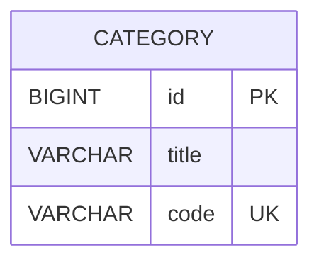

# shop

카테고리 트리를 Materialized Path로 구현한 예제 프로젝트입니다. 카테고리는 생성/수정/삭제 빈도는 낮고 조회 빈도가 높다는 가정하에, 조회 성능 최적화를 우선으로 설계했습니다.

## 주요 설계와 의도

- 자료구조: Materialized Path
    - 부모 카테고리의 code를 자식이 prefix로 상속받는 구조입니다.
    - 예) 상의(001) → 티셔츠(001002) → 반팔(001002003)
- 세그먼트 정책
    - 각 계층의 세그먼트 길이는 3자리 숫자 고정입니다. 예: 001, 002, 003 ...
- 인덱스/조회 전략
    - code 컬럼에 인덱스를 두고, prefix 조회(code LIKE '001%')를 통해 서브트리 조회를 빠르게 합니다.

## 실패했던 방법들

- 엔티티 간 직접 연관관계 매핑
    - 엔티티 간 직접 연관으로 계층을 탐색할 때 부모 노드 수만큼 select가 발생하는 문제를 확인했고,
    - 그 후 부모자식을 id 로 단방향 관리하고
    - 루트노드를 공유하는 노드들에, rootId 를 공유하게 하여 모집단을 최소화 시키고 조회하는 방법을 택했습니다.
- 루트가 여러 개인 트리 묶음(rootId 공유)
    - 상의/하의/아우터 등 여러 루트가 공존하는 트리 집합을 전제로 합니다.
    - 초기에는 rootId 공유 + 부모/자식 싱크를 함께 관리했으나,
    - 여전히 불필요한 데이터를 가져와야하는 문제가 있었으며, 관리 복잡도를 줄이기 위해 Materialized Path로 일원화했습니다.

## 실행 방법

- 스펙: Kotlin, Java 17
- 서버 실행: Gradle 빌드 후 애플리케이션 실행
- DB DDL 은 flyway 로 자동 실행됩니다.
- Swagger UI: http://localhost:28080/swagger-ui/index.html#/
- H2 Console: http://localhost:28080/h2-console
    - Driver Class: org.h2.Driver
    - JDBC URL: jdbc:h2:mem:test
    - User Name: test
    - Password: test

## Category Table



## 테스트 방법

- Swagger에서 API 직접 호출 (http://localhost:28080/swagger-ui/index.html#/)
- 스웨거 테스트 컨트롤러(/test) 실행 시: 테스트 데이터 샘플로 전체 초기화됩니다.

### 테스트 데이터 샘플(title, code)

```
상의 001
├── 티셔츠 001002
│   ├── 반팔 001002003
│   └── 긴팔 001002004
└── 셔츠 001005
    ├── 옥스포드 001005006
    └── 린넨 001005007
        ├── 얇은 001005007008
        └── 두꺼운 001005007009

하의 010
├── 청바지 010011
│   ├── 스트레이트 010011012
│   └── 슬림 010011013
├── 슬랙스 010014
└── 반바지 010015

아우터 016
├── 코트 016017
│   └── 트렌치 016017018
│       ├── 롱 016017018019
│       └── 숏 016017018020
└── 자켓 016021

악세서리 022
├── 모자 022023
│   ├── 비니 022023024
│   └── 볼캡 022023025
├── 벨트 022026
└── 양말 022027
    ├── 캐주얼 022027028
    │   └── 단목 022027028029
    └── 스포츠 022027030
        └── 기능성 022027030031
```